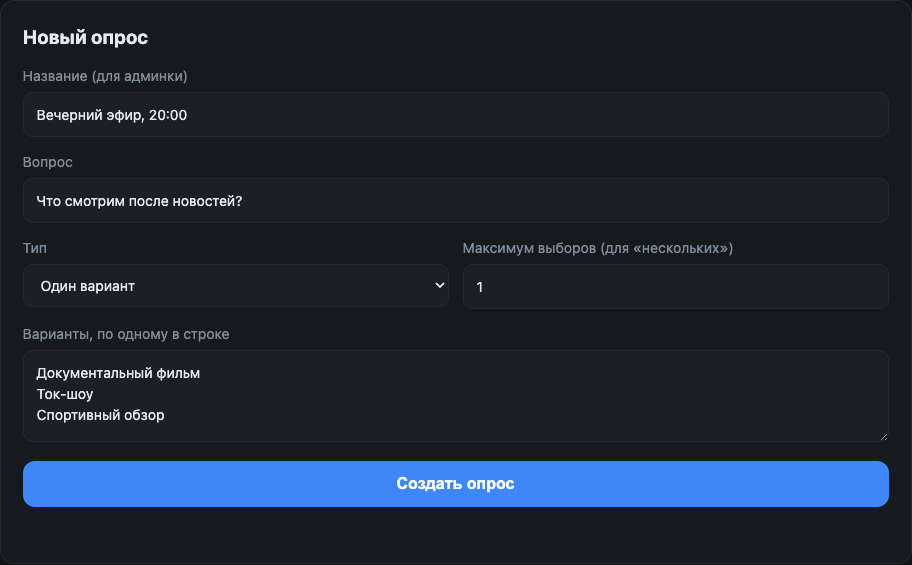
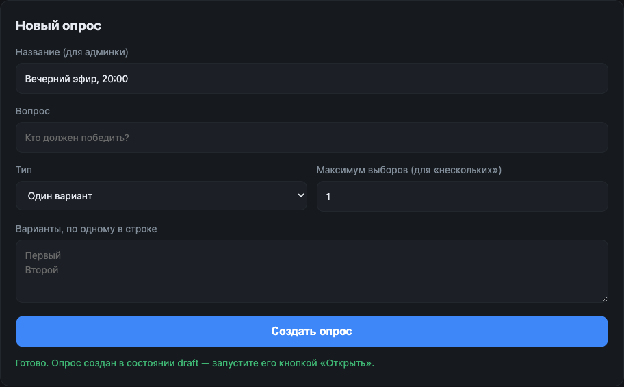
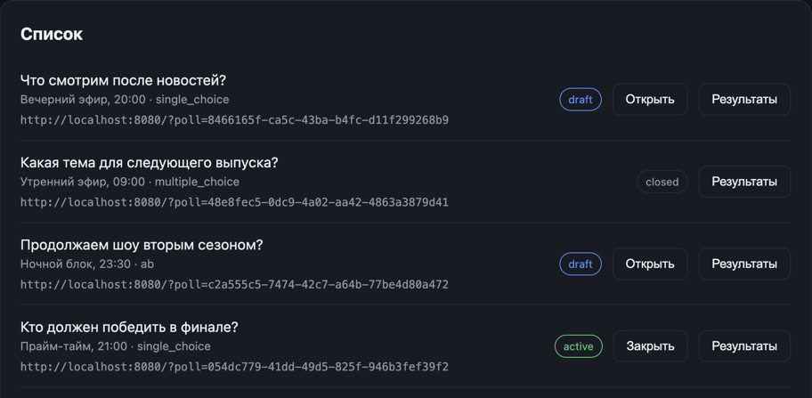
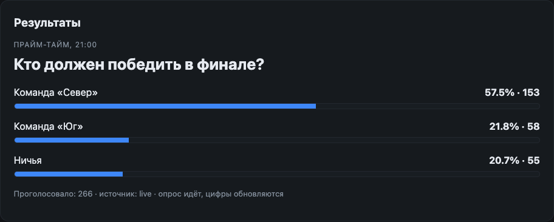
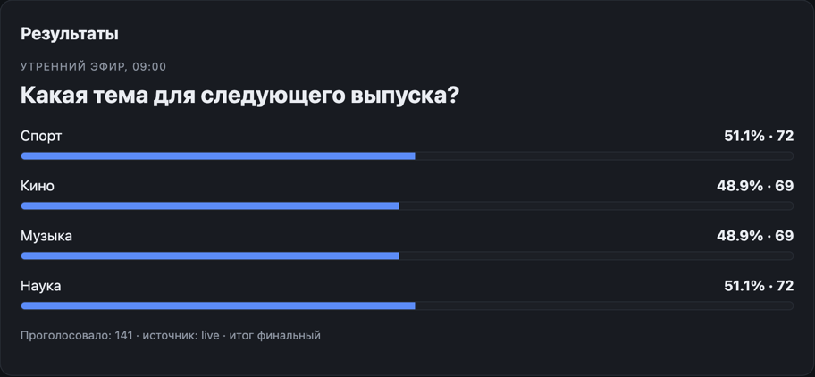
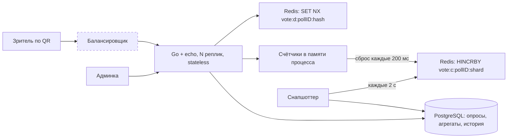

# test_vote — сервис анонимных опросов для телеэфира

Зритель видит на экране QR-код, открывает страницу, жмёт кнопку. Результаты
обновляются в прямом эфире. Регистрации нет, голосование анонимное.

Расчётная нагрузка — 100 миллионов зрителей и окно голосования около минуты.
При участии 10–20% это 10–20 миллионов голосов в минуту: в среднем 250 тысяч
запросов в секунду, до 500 тысяч в первые секунды после появления кода на
экране. Вся архитектура следует из этой цифры.

## Запуск

```bash
make up        # postgres и redis в docker
make migrate   # миграции
make run       # сервис на localhost:8080
```

Демо-опрос одной командой:

```bash
make seed
# poll_id:    9986ef3e-...
# голосовать: http://localhost:8080/?poll=9986ef3e-...
# админка:    http://localhost:8080/admin.html
```

Всё вместе в контейнерах — `make up-all`. Список целей — `make help`.

### Ручная проверка

1. `make seed`, открыть напечатанную ссылку — это страница голосования.
2. Нажать вариант: появятся результаты, `Голос учтён`.
3. Обновить страницу и проголосовать снова: `С этого устройства уже голосовали`.
   Дедупликация сработала.
4. Открыть ту же ссылку в приватном окне и проголосовать: голос примут.
   Это ожидаемо — см. [границы дедупликации](#дедупликация).
5. Открыть `http://localhost:8080/admin.html`, ввести токен `local-admin-token`:
   виден список опросов, живые результаты и кнопка «Закрыть».
6. После закрытия голоса не принимаются, результаты помечены как финальные.

## Скриншоты работы

Админка `admin.html` — весь цикл ведения эфира. Снято с локального запуска,
цифры настоящие.

**Создание опроса.** Название нужно только админке, зритель видит вопрос.
Максимум выборов работает для типа «несколько вариантов»; для `single_choice` и
`ab` он игнорируется.



Опрос создаётся в состоянии `draft` и голосов не принимает — это защита от
случайной публикации незаконченного вопроса.



**Список опросов.** Статус, кнопки перехода (`Открыть` для черновика, `Закрыть`
для идущего) и готовая ссылка для QR-кода. Переходы только вперёд, поэтому у
закрытого опроса кнопки статуса нет.



**Живые результаты.** Пока опрос идёт, панель сама перезапрашивает цифры раз в
две секунды. `источник: live` означает, что счётчики прочитаны из Redis.



**Финальные результаты.** После закрытия итог помечен как финальный. Здесь тип
`multiple_choice` с двумя выборами на зрителя, поэтому доли считаются от числа
проголосовавших и в сумме дают больше 100%: 141 зритель отдал 282 голоса.



Числа на скриншотах скромные, потому что демо-голоса шли с одного адреса и
[лимитер по IP](#дедупликация) отсёк лишнее — из 2400 запросов до сервиса
дошло около 400. Это ожидаемое поведение защиты, а не потолок сервиса;
измеренная пропускная способность — в разделе
[нагрузочного тестирования](#нагрузочное-тестирование).

## Архитектура



Пунктиром — то, чего в этом репозитории нет. Балансировщик и несколько реплик
относятся к окружению (ingress в Kubernetes, nginx, облачный L7), и в тестовом
задании они не воспроизводятся: `make run` поднимает один процесс, compose —
один контейнер с проброшенным портом 8080. Схема показывает целевую топологию,
из которой считалась [арифметика масштабирования](#арифметика-масштабирования-до-500k-rps).

Требования к балансировщику у сервиса скромные, и код к ним готов:

- **Sticky sessions не нужны.** Реплики stateless, дедупликация целиком в Redis,
  поэтому любой запрос зрителя может попасть в любую реплику. Достаточно
  round-robin или least-connections.
- **`X-Forwarded-For` должен доезжать.** По реальному адресу работают лимитер и
  запасное опознание зрителя без куки. Сервер разбирает заголовок через
  `echo.ExtractIPFromXFFHeader()` и доверяет ему только от приватных сетей —
  иначе лимит обходился бы подделкой заголовка.
- **У каждой реплики свой `INSTANCE_ID`.** От него зависит, в какой из 64 шардов
  счётчиков реплика пишет. Пустое значение генерируется при старте, в Kubernetes
  естественно подставить имя пода.

### Горячий путь

На один голос приходится **ровно один поход в Redis**:

1. Зритель открывает страницу опроса — сервер выдаёт куку `vid`
   (UUID, подписанный HMAC).
2. Голос приходит с этой кукой. Сервис берёт определение опроса из кэша в
   памяти (TTL 1 секунда) и проверяет, что вариант принадлежит опросу.
3. `SET vote:d:<poll>:<hash> 1 NX EX <ttl>` — атомарно проверяет и ставит
   отметку. Вернулся nil — `409 already_voted`.
4. Голос прибавляется к счётчику **в памяти процесса**. Фоновый сброс раз в
   200 мс отправляет накопленное в Redis через `HINCRBY`.

Ни PostgreSQL, ни сеть между репликами в этот путь не входят.

### Почему счётчики в памяти

Инкремент в Redis на каждый голос удвоил бы число операций и сделал бы счётчик
опроса горячим ключом: один опрос — один ключ — одна нода кластера. С
накоплением в памяти реплика на 20 тысячах голосов в секунду делает **5 сбросов
в секунду** вместо 20 тысяч инкрементов.

Внутри процесса счётчик разложен на 64 атомика, каждый занимает кэш-линию
целиком: иначе ядра дерутся за одну линию при каждом инкременте. Разница
измерена — 19 нс против 155 нс.

В Redis счётчики опроса размазаны по 64 ключам, каждая реплика пишет в свой
шард. Чтение складывает шарды и происходит редко: результаты кэшируются на
полсекунды.

Подробности и цифры — [ADR 0003](docs/adr/0003-in-memory-aggregation.md).

## Выбор хранилищ

**PostgreSQL** — опросы, варианты, статусы, агрегаты результатов и их история.
Нагрузка низкая, нужны транзакции и внятная схема. Клиент — `pgx/v5` пулом.

**Redis** — дедуп-ключи и счётчики. Около 20 миллионов ключей на опрос по
~70 байт, это порядка 1,5 ГБ; TTL ограничен временем опроса с запасом.
Клиент — `rueidis`: он сам склеивает конкурентные запросы в один пакет на
соединении, поэтому на голос приходится заметно меньше системных вызовов, чем
при схеме «соединение из пула на запрос».

**Строку на каждый голос в PostgreSQL не пишем.** 330 тысяч INSERT в секунду —
за пределами разумного для реляционного кластера, а сырой поток голосов задаче
не нужен: требуются обезличенные результаты.

**Kafka и ClickHouse рассмотрены и отклонены.** Очередь между API и хранилищем
нужна, когда важен сырой поток событий. Здесь нужен только агрегат, известный в
момент голоса, и очередь добавила бы латентность и ещё один распределённый
компонент в критический путь. Точка расширения, если поток всё же понадобится
(антифрод, аналитика по регионам), описана в
[ADR 0001](docs/adr/0001-redis-for-hot-path.md).

## Дедупликация

Кука `vid` — UUID с подписью HMAC-SHA256 на серверном секрете. Подпись нужна не
ради защиты голоса, а чтобы кука не была произвольной строкой от клиента:
иначе дедупликация обходилась бы одним заголовком в каждом запросе.

Если рабочей куки нет, зритель опознаётся по подсети (/24 для IPv4, /64 для
IPv6) и User-Agent.

**Что ловится:** повторное нажатие, F5, возврат на страницу, попытка
проголосовать ещё раз с того же телефона.

**Что не ловится:** инкогнито, другой браузер, другое устройство, смена сети,
скрипт со своим хранилищем кук.

Это не недосмотр. Задание требует дедупликацию «на уровне обычных, не
технически подкованных пользователей»; без регистрации более сильные гарантии
недостижимы в принципе. От простого скрипта в цикле дополнительно защищает
лимитер по IP на входе.

Почему не Lua-скрипт, почему хэш стоит в конце ключа и почему отклонён лимит
голосов на подсеть — [ADR 0002](docs/adr/0002-dedup-by-signed-cookie.md).

## API

Публичный:

| Метод | Путь | Ответ |
|---|---|---|
| `GET` | `/api/v1/polls/{id}` | определение опроса, выдаёт куку голосующего |
| `POST` | `/api/v1/polls/{id}/vote` | `202` принят · `409 already_voted` · `410 poll_not_accepting` · `400` |
| `GET` | `/api/v1/polls/{id}/results` | обезличенные агрегаты |

Админский, `Authorization: Bearer <ADMIN_TOKEN>`:

| Метод | Путь | Назначение |
|---|---|---|
| `GET` | `/api/v1/admin/polls` | список опросов |
| `POST` | `/api/v1/admin/polls` | создать (`single_choice`, `multiple_choice`, `ab`) |
| `POST` | `/api/v1/admin/polls/{id}/status` | `active` или `closed` |
| `GET` | `/api/v1/admin/polls/{id}/results` | агрегаты |
| `GET` | `/api/v1/admin/polls/{id}/timeline` | динамика по снимкам |

Голос отдаёт `202`, а не `200`: он принят и гарантированно учтён, но в общий
счётчик попадёт вместе с ближайшим сбросом. Ошибки приходят единым конвертом
`{"error": {"code": "...", "message": "..."}}` — фронтенд различает ситуации по
`code`, а не по тексту.

Опрос создаётся в состоянии `draft` и голосов не принимает. Переходы —
только вперёд: `draft → active → closed`. Закрытый опрос переоткрыть нельзя,
иначе «финальный итог» ничего не значит.

## Структура

```
test_vote/
├── docker-compose.yml
├── Makefile
├── docs/{adr,ai}/               # архитектурные решения и артефакты работы с ИИ
├── backend/
│   ├── cmd/service/main.go      # конфиг → логгер → pg → redis → DI → echo
│   ├── configs/config.local.toml
│   ├── db/                      # миграции, вшитые в бинарь
│   └── internal/
│       ├── config/              # toml + validator + переменные окружения
│       ├── pgstorage/           # обёртка pgxpool
│       ├── redisstorage/        # обёртка rueidis
│       ├── counters/            # агрегатор в памяти и фоновый сброс
│       ├── dedup/               # подпись куки и ключи дедупликации
│       ├── snapshot/            # Redis → PostgreSQL
│       ├── observability/       # slog и метрики
│       ├── service/
│       │   ├── poll/            # опросы: PostgreSQL + кэш определения
│       │   ├── vote/            # голоса: Redis
│       │   └── results/         # результаты: живые счётчики или сохранённый итог
│       └── http/                # echo, прослойки, по пакету на ручку
├── frontend/                    # index.html (голосование), admin.html
└── loadtest/                    # k6-сценарии и результаты замеров
```

## Нагрузочное тестирование

Apple M4 Pro (14 ядер). Сервис, PostgreSQL, Redis и сам генератор — на одной
машине, поэтому числа занижены.

| Сценарий | Нагрузка | p50 | p95 | Ошибки |
|---|---|---|---|---|
| Полный путь зрителя (страница + голос) | 6 000 голосов/с | 0,49 мс | 0,99 мс | 0 |
| Полный путь зрителя | 12 000 голосов/с (24 000 HTTP-запросов/с) | 1,23 мс | 3,57 мс | 0 |
| Только `POST /vote` | **45 000 запросов/с** | 8,46 мс | 12,79 мс | 0 |

За все прогоны принято 1 793 670 голосов. Метрика `vote_flushed_deltas_total`
показала ровно столько же, `vote_flush_errors_total` — ноль: до Redis доехал
каждый голос.

Локальная машина 500 тысяч запросов в секунду не сгенерирует, и это надо
называть своим именем: приведённые числа — потолок одного инстанса, а не
проверка целевой нагрузки.

### Арифметика масштабирования до 500k RPS

Реплики API stateless, состояние — только счётчики между сбросами.

- **API:** 500 000 / 45 000 ≈ 12 реплик. С запасом на деградацию и выкатку —
  **20 реплик** по 4–8 ядер. Отдельная машина без конкуренции за CPU покажет
  больше 45k, так что это оценка сверху.
- **Redis:** голос — одна команда `SET NX`, то есть 500 тысяч операций в
  секунду. Одна нода с автопайплайнингом тянет порядка 100–150 тысяч, значит
  нужен кластер из **6–8 мастеров** с репликами. Ключи дедупликации по
  построению равномерно расходятся по слотам, счётчики размазаны по 64 шардам —
  горячих ключей нет.
- **Сброс счётчиков:** 20 реплик × 5 сбросов в секунду — сотня операций в
  секунду. На фоне 500 тысяч не считается.
- **PostgreSQL:** снапшоттер пишет одну транзакцию на опрос раз в 2 секунды.
  Одного инстанса хватает с огромным запасом.
- **Память Redis:** 20 миллионов дедуп-ключей по ~70 байт ≈ 1,5 ГБ на опрос,
  распределённые по кластеру. TTL привязан к длительности опроса.

Подробности прогонов и микробенчмарки — [loadtest/README.md](loadtest/README.md).

## Наблюдаемость

Метрики Prometheus и `pprof` — на отдельном порту `:8081`, наружу такое не
выставляют.

| Метрика | О чём |
|---|---|
| `vote_votes_total{outcome}` | голоса по исходу: accepted, duplicate, rejected |
| `vote_cast_duration_seconds` | полное время обработки голоса |
| `vote_dedup_duration_seconds` | round-trip дедупликации в Redis |
| `vote_flushed_deltas_total` | голоса, доехавшие из памяти в Redis |
| `vote_pending_deltas` | застрявшие после неудачного сброса |
| `vote_snapshot_errors_total` | сбои переноса агрегатов в PostgreSQL |

Расхождение между `vote_votes_total{outcome="accepted"}` и
`vote_flushed_deltas_total` — прямой индикатор потери голосов.

## Тесты и инструменты

```bash
make test              # юнит-тесты с -race
make test-integration  # против поднятых postgres и redis
make bench             # микробенчмарки счётчиков и дедупликации
make lint              # golangci-lint
```

Юнит-тесты на сервисах используют моки `go.uber.org/mock`, сгенерированные
`mockgen` (`make generate`). Интеграционные лежат под тегом `integration` и
включают сквозной прогон HTTP-слоя со всеми зависимостями: создание опроса,
голосование, дедупликация, закрытие и переход результатов в финальные.

## Осознанные ограничения

**Потеря до 200 мс голосов при жёстком падении реплики.** Это цена накопления
в памяти. При штатной остановке сервис сначала перестаёт принимать запросы и
только потом останавливает сброс, поэтому последний сброс успевает пройти;
неудавшийся сброс возвращает дельты в агрегатор. Размен сформулирован явно в
[ADR 0003](docs/adr/0003-in-memory-aggregation.md): доступность и пропускная
способность против точности.

**Потеря Redis во время опроса** означает потерю голосов с последнего снимка
(до 2 секунд). Персистентность отключена сознательно: она стоила бы латентности
на горячем пути, а долговременный результат обеспечивает снапшоттер.

**Кэш определения опроса живёт секунду**, поэтому закрытие опроса разъезжается
по репликам не мгновенно. Реплика, где статус сменили, сбрасывает кэш сразу.

**Админка защищена статическим токеном.** Для тестового задания этого
достаточно; в проде нужна нормальная аутентификация с пользователями и ролями.

**Снапшоттер обходит опросы последовательно.** При десятках одновременных
эфиров это станет узким местом и потребует параллельного обхода.

**Дедупликация обходится инкогнито.** См. раздел выше — это свойство задачи,
а не реализации.

### Что нужно для настоящего прода

- Redis Cluster вместо одной ноды; `rueidis` работает с ним без изменений в коде.
- Секреты (`ADMIN_TOKEN`, `COOKIE_SECRET`) из хранилища секретов, а не из конфига.
- Миграции отдельным шагом деплоя, а не при старте каждой реплики.
- Ротация секрета подписи кук с поддержкой предыдущего ключа на время перехода.
- Аутентификация админки и аудит действий.
- Алерты на `vote_pending_deltas`, `vote_flush_errors_total` и расхождение
  принятых и сброшенных голосов.